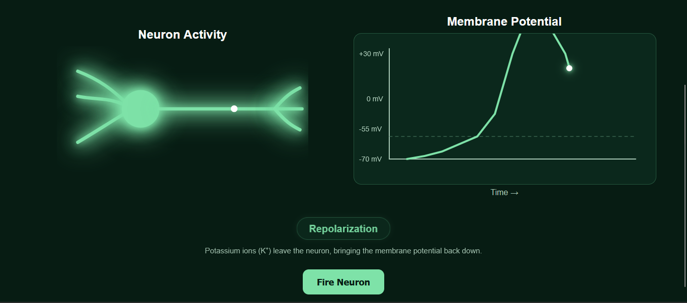

# Neuronexus — Action Potential Simulator ⚡

An interactive visualization of how a neuron generates an action potential.

## Preview

## 🧠 About

This project turns the biology of an action potential into an interactive
visual experience.

Click **Fire Neuron** to watch the electrical signal travel through the
neuron while the membrane potential changes simultaneously on the graph.

## ⚡ What it demonstrates

- Resting potential
- Threshold
- Depolarization
- Peak
- Repolarization
- Hyperpolarization
- Return to resting potential

## 🛠️ Built With

- HTML
- CSS
- JavaScript
- SVG
- HTML Canvas

## Live Demo

[Try the Action Potential Simulator]https://niamaty22-ship-it.github.io/action-potential-simulator/
## 🎯 Why I Built This

I wanted to explore how neuroscience concepts could be transformed from
static diagrams into interactive educational experiences.

This project is part of my broader interest in making neuroscience more
accessible and engaging through technology.

## 🚀 Future Ideas

- Visualize sodium and potassium ion movement
- Add synaptic transmission
- Add more neuroscience simulations
- Create a collection of interactive neuroscience lessons

## 👩‍💻 Author

Niama Taya
